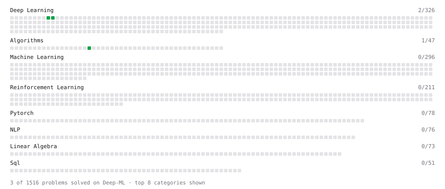

# Deep-ML

My machine learning practice from [Deep-ML](https://www.deep-ml.com). Every solution here was written by hand.

**4** solved · 3 problems · 0 labs · 1 math

[**Browse the interactive portfolio**](https://sreekarsrit.github.io/deep-ml/) to replay this filling in over time.

## Problems

| | Difficulty | Solved | |
| --- | --- | --- | --- |
| [First N Fibonacci Numbers](https://www.deep-ml.com/problems/1151) | easy | 2026-09-18 | [solution](problems/1151-first-n-fibonacci-numbers) |
| [Implement ReLU Activation Function](https://www.deep-ml.com/problems/42) | easy | 2026-09-17 | [solution](problems/0042-implement-relu-activation-function) |
| [Leaky ReLU Activation Function](https://www.deep-ml.com/problems/44) | easy | 2026-09-18 | [solution](problems/0044-leaky-relu-activation-function) |

## Math

| | Difficulty | Solved | |
| --- | --- | --- | --- |
| [Vector Operations](https://www.deep-ml.com/math-problems/7) | easy | 2026-10-06 | [solution](math/0007-vector-operations) |

---

_This file is regenerated by Deep-ML on every push._
